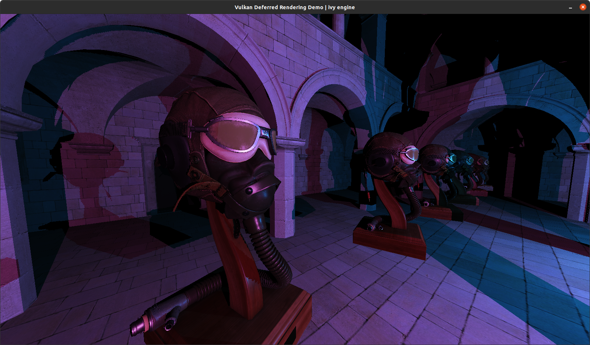

# ivy

This is a personal project of mine to improve my Vulkan knowledge and experience.

The goal is to create a Vulkan renderer frontend that is easy to use and hard to screw up.



### Example code

Below is example code for a simple deferred renderer. For a full working example [look here](src/test_game/renderer.cpp) 

**Renderer initialization code**
```c++
// Build our graphics pass
passes_.emplace_back(
    gfx::GraphicsPassBuilder(device_)
    // Add our attachments to our graphics pass. Name them for future referencing
    .addAttachmentSwapchain()
    .addAttachment("albedo", VK_FORMAT_R8G8B8A8_UNORM)
    .addAttachment("position", VK_FORMAT_R16G16B16A16_SFLOAT)
    .addAttachment("depth", VK_FORMAT_D32_SFLOAT)
    
    // Add our gbuffer subpass
    .addSubpass("gbuffer_pass",
        gfx::SubpassBuilder()
        // Add shaders to our gbuffer subpass
        .addShader(gfx::Shader::StageEnum::VERTEX, "gbuffer.vert.spv")
        .addShader(gfx::Shader::StageEnum::FRAGMENT, "gbuffer.frag.spv")
        
        // Add a vertex description
        .addVertexDescription(gfx::VertexP3C3::getBindingDescriptions(), gfx::VertexP3C3::getAttributeDescriptions())
        
        // Output color to our albedo (at location 0) and position (at location 1) attachments
        .addColorAttachment("albedo", 0)
        .addColorAttachment("position", 1)
        .addDepthAttachment("depth", 2)
        
        // Add a uniform buffer to our subpass (in set 0, binding 0)
        .addUniformBuffer(0, 0, VK_SHADER_STAGE_VERTEX_BIT)
        .build()
    )
    
    // Add our lighting subpass
    .addSubpass("lighting_pass",
        gfx::SubpassBuilder()
        // Shaders
        .addShader(gfx::Shader::StageEnum::VERTEX, "lighting.vert.spv")
        .addShader(gfx::Shader::StageEnum::FRAGMENT, "lighting.frag.spv")

        // Output color to swapchain at location 0
        .addColorAttachment(gfx::GraphicsPass::SwapchainName, 0)
        
        // Input attachments from previous subpass (in set 0 and bindings 0, 1, and 2 respectively)
        .addInputAttachment(0, 0, "albedo")
        .addInputAttachment(0, 1, "position")
        .addInputAttachment(0, 2, "depth")
        
        .build()
    )
    
    // Describe an external dependency
    .addSubpassDependency(gfx::GraphicsPass::SwapchainName, "gbuffer_pass", 
                          VK_PIPELINE_STAGE_COLOR_ATTACHMENT_OUTPUT_BIT,
                          VK_PIPELINE_STAGE_COLOR_ATTACHMENT_OUTPUT_BIT, 
                          0, 
                          VK_ACCESS_COLOR_ATTACHMENT_WRITE_BIT)
    // Describe a dependency between subpasses
    .addSubpassDependency("gbuffer_pass", "lighting_pass", 
                          VK_PIPELINE_STAGE_COLOR_ATTACHMENT_OUTPUT_BIT,
                          VK_PIPELINE_STAGE_FRAGMENT_SHADER_BIT, 
                          VK_ACCESS_COLOR_ATTACHMENT_WRITE_BIT, 
                          VK_ACCESS_SHADER_READ_BIT)
    .build()
);
```

**Create a vertex buffer**
```c++
gfx::VertexP3C3 vertices[] = {
    gfx::VertexP3C3({ 0.0f, -0.5f,  0.0f}, {1.0f, 0.0f, 0.0f}),
    gfx::VertexP3C3({ 0.5f,  0.5f, -0.5f}, {0.0f, 1.0f, 0.0f}),
    gfx::VertexP3C3({-0.5f,  0.5f, -1.0f}, {0.0f, 0.0f, 1.0f})
};

vertexBuffer_ = device_.createVertexBuffer(
    vertices, sizeof(vertices[0]) * COUNTOF(vertices)
);
```

**Render loop code**
```c++
// Start the frame and get our command buffer
device_.beginFrame();
gfx::CommandBuffer cmd = device_.getCommandBuffer();
gfx::GraphicsPass &pass = passes_.front();

// Execute our graphics pass
cmd.executeGraphicsPass(device_, pass, [&]() {
    u32 subpassIdx = 0;

    f32 aspectRatio = 800.0f / 600.0f;
    
    // Subpass 0, g-buffer
    {
        // Bind graphics pipeline
        cmd.bindGraphicsPipeline(pass, subpassIdx);

        // Set MVP data on CPU
        struct MVP {
            alignas(16) glm::mat4 proj  = glm::perspective(glm::half_pi<f32>(), aspectRatio, 0.01f, 10.0f);
            alignas(16) glm::mat4 view  = glm::lookAt(glm::vec3(0), glm::vec3(0, 0, -1), glm::vec3(0, 1, 0));
            alignas(16) glm::mat4 model = glm::translate(glm::mat4(1), glm::vec3(0, std::sin(glfwGetTime()), 0));
        } mvpData;

        // Put MVP data in a descriptor set and bind it
        gfx::DescriptorSet mvpSet(pass, subpassIdx, 0);
        mvpSet.setUniformBuffer(0, mvpData);
        cmd.setDescriptorSet(device_, pass, mvpSet);

        // Bind vertex buffer and draw
        cmd.bindVertexBuffer(vertexBuffer_);
        cmd.draw(COUNTOF(vertices), 1, 0, 0);
    }

    // Subpass 1, lighting
    {
        ++subpassIdx;
        cmd.nextSubpass();

        // Bind graphics pipeline
        cmd.bindGraphicsPipeline(pass, subpassIdx);

        // Set our input attachments in descriptor set and bind it
        gfx::DescriptorSet inputAttachmentsSet(pass, subpassIdx, 0);
        inputAttachmentsSet.setInputAttachment(0, "albedo");
        inputAttachmentsSet.setInputAttachment(1, "position");
        inputAttachmentsSet.setInputAttachment(2, "depth");
        cmd.setDescriptorSet(device_, pass, inputAttachmentsSet);

        // Draw our fullscreen triangle
        cmd.draw(3, 1, 0, 0);
    }
});

// End the frame
device_.endFrame();
```
